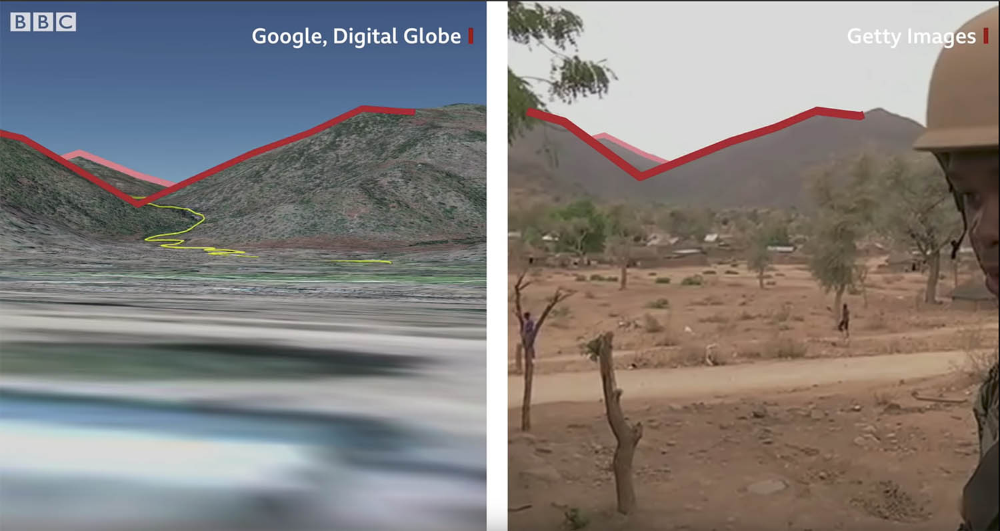
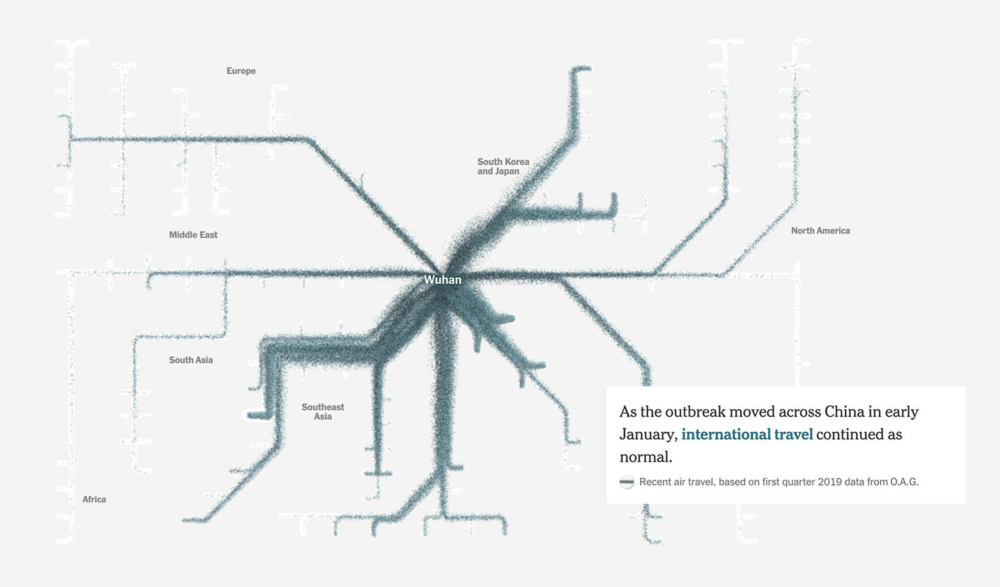

### Two Data Stories - Week 6

#### *Cameroon atrocity: Finding the soldiers who killed this woman*
[*The Anatomy of Killing*](https://www.bbc.com/news/av/world-africa-45599973/cameroon-atrocity-finding-the-soldiers-who-killed-this-woman) is the an investigation project into the atrocity in Cameroon based on video footages cirlulated on social media, published by BBC in September 2018. The video journalism demostrate the internet-based investigation which gather forensic evidence by pulling details from the source video and compare with public satellite imageries and social media profiles. The investigative experts were able to precise locate the crime scene in Cameroon and identify the trigger pullers as alleged soldiers. It was an impressive investigation which introduced further judical reviews on the unfortunate case and broaden our horizons on how planet scale geographic data can be used as forensic tools.

#### *How the Virus Got Out*
[*How the Virus Got Out*](https://www.nytimes.com/interactive/2020/03/22/world/coronavirus-spread.html) is an animated data visualzation tracing the movement of people across the globe, published by NYT on March 22 2020. Having heard plenty of news from mid January as a Chinese person, the textual details of the report are nothing new to me, but the visualization is truly refreshing for bringing the scale of impact and the chronology of events to life. The global landscape is visualized as routes of human traffic instead of a geological map. Compared with a static visualzation, the animated particles in the NYT version create the urgent liveness, of how people travel in the age of globalization and the unstoppable nature of virus. 

