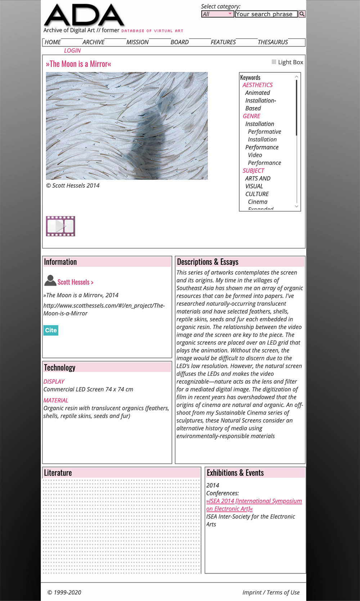

### Pre-Selection: 3 Datasets - Week 7

#### The Museum of Modern Art (MoMA) collection data
[The Museum of Modern Art (MoMA) collection data](https://github.com/MuseumofModernArt/collection) is a comprehensive dataset of artwork collections at MoMA and the related artists from around the world spanning the last 150 years. The dataset contains a variety of attribute of artworks including nationality, medium, dimensions, classificastions, and the date of acquisition. In the most naive way, I am imagining visualization the animated chronicle of aquisiton classified in discipline, nationality and etc. A more concrete use will incorporate the date of major artistic movements and important artist, and a more abstract and poetic use might elaborate on the dimensions and meterials of artworks. As it has been a while since the dataset went live, some visualizations have made, most of which I found were great but somehow less animated and interactive, including [MoMA and its artwork in data](https://towardsdatascience.com/moma-and-its-artwork-in-data-60925c8acb7a), [MoMA Mia!](http://people.ischool.berkeley.edu/~sberthely/MomaMia_Final/) (a lovely student project from UC Berkeley) and of course [MoMA through Time](https://www.moma.org/interactives/moma_through_time/) by MoMA itself. Given these existing analysis and references, I'll have to be more creative on the visualization perspective.

#### The Museum of Modern Art (MoMA) Exhibition and Staff Histories
Fairly similar to the first one, [The Museum of Modern Art (MoMA) Exhibition and Staff Histories](https://github.com/MuseumofModernArt/exhibitions) is yet another dataset from MoMA which collect the exhibition data from 1929 through 1989. It could be interesting to see the interplay between exhibitions and collections, revealing facts, such as the average duration between an artist's exhibition and the collection of his work and how it had changed over time.

#### Archive of Digital Art
The [Archive of Digital Art](https://www.digitalartarchive.at/database/database-info/archive.html) has an archive of digital artworks from 1979 through 2014. The selection is claimed to be scientific with the appreciation of "high importance to artistic inventions like innovative interfaces, displays or software". Every archived work comes with a good amount of descriptions along with pictures, as is shown below. As it is an archival website, data shall be scraped for later visualzation. Sythesized with the MoMA data, I am interested in the interactions between the evolution of digital arts and the ones of more traditional media.

